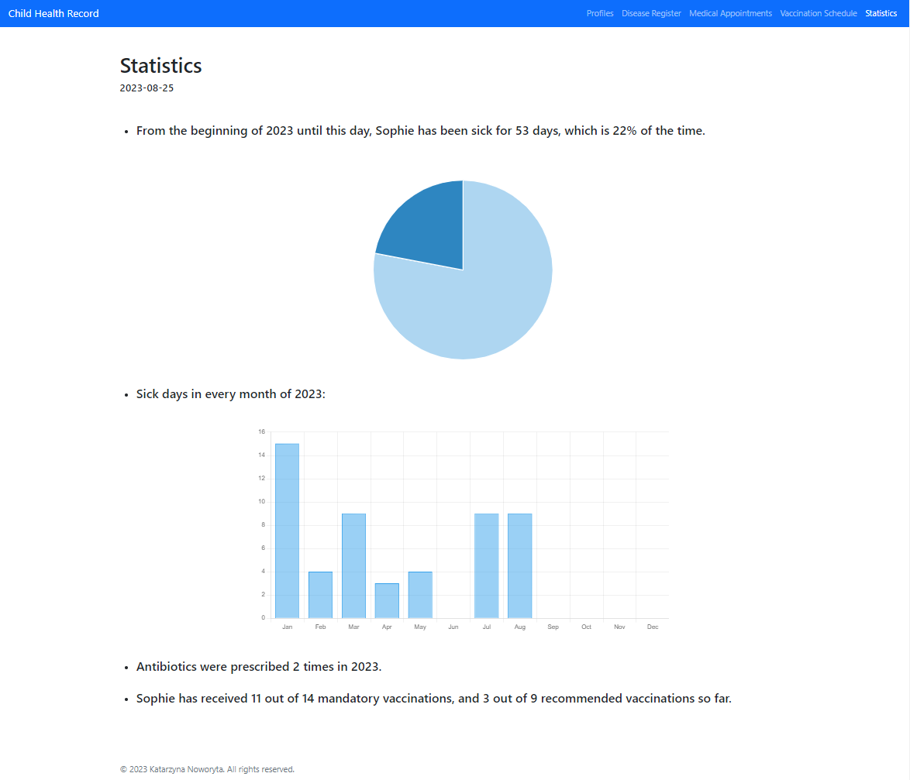

Katarzyna Noworyta
# Child-Health-Record

The application was created to keep a record of information related to the child’s health. Child Health Record includes information on diseases, medical visits, vaccinations and their statistics. It allows to collect infomation in an orderly manner and based on it, draw conclusions and notice regularities, which are an important source of knowledge. 

The register consists of the following parts:
- <b>Disease Register</b> – it is used to enter data on the child’s ilness: type of disease, duration, symptoms. Disease Register also includes information wheather a medical visit was made in connection with a given ilness. Each entry in the register also has the functionality of editing or deleting data.
  
- <b>Medical Appointments</b> – it allows to enter data on doctor visits: date of appointment, diagnosis, prediscribed medications,  information whether an antibiotic has been prescribed and notes. There is also a possibility to connect information about which disease fom the disease Register the visit concerns by selecting disease id from the list. Medical Appointmets register has also the option of editing or deleting data.
  
- <b>Vaccination Schedule</b> – contains a list of mandatory and recommnded vaccinations with option of marking the status as: to arragne, arranged, done, not applicable. There is also a possibility to add and edit notes witch each vaccination, such as date and time of the scheduled vaccination, post-vaccination symptoms or other infomation.
  
- <b>Statistics</b> – summarizes the infomation and conclusions from the three previous sections. There is a graph showing what proportion of days from the begginning of the year to the current date the child was sick. The second graph shows the number of days the child was sick in each month. Statistics section also includes information on how many time san antibiotic was prescribed in 2023 and how many of the mandatory and reccomended vaccinations have already been done for childern.   
 

## Technical assumptions  
Child Health Record web application is based on data on diseases, doctor visits and vaccinations in 2023, entered by the user and saved in the database. The entered data are validated in terms of whether they are not empty or the number of characters. In the cases of disease symptoms, prediscribed antibiotic or id of the disease to which the doctor’s visit realtes, the data is selected from a closed, drop-down list. 

The application consists of the following views:  
      - diseases data list 
      

      
      

      - creating a new disease entry  
       

      
      

       
    - medical appointments details list  
       

      
      

     
    - creating a new appointment entry  
        

      
      

     
    - vaccination schedule  
        

      
      

     
    - statistics  
       

      
      

 

## Tech stack
- Java
- Maven
- Spring Boot(Web, JPA, Validation)
- SQL Server, PostgreSQL
- Thymeleaf
- Bootstrap
- Chart.js
- Railway.app

